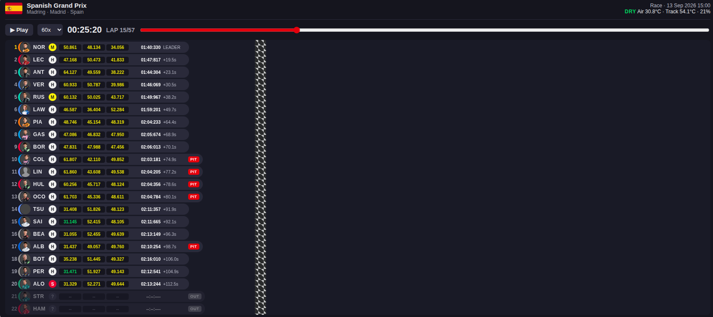

# MCP Sport — F1 Telemetry MCP 🏎️

<!-- mcp-name: io.github.andrequeiroz2/mcp-sport -->



An **MCP (Model Context Protocol)** server that exposes Formula 1 data from the
[OpenF1 API](https://openf1.org/docs/) as tools for AI assistants
(Claude Desktop, Cursor, MCP Inspector, etc.).

Full coverage: **18 data tools** matching the 18 documented OpenF1 endpoints —
sessions, meetings, drivers, results, laps, pit stops, stints, telemetry,
weather, championships and more. Two **MCP App views** sit on top of that
data: a drivers standings board and an animated race replay. Hosts that
render MCP Apps show the HTML. Cursor and Claude Desktop do not: they
return the same payload as JSON.

## Stack

| Layer | Technology |
|---|---|
| Language | Python 3.13+ |
| MCP framework | FastMCP 4.x |
| Validation | Pydantic v2 |
| Data | OpenF1 API (REST, free for historical data 2023+) |
| Project management | uv + pyproject.toml |
| Transport | stdio |

## Installation

```bash
# Clone and install dependencies
git clone https://github.com/andrequeiroz2/mcp-sport.git mcp-sport
cd mcp-sport
uv sync
```

## Usage

### Run the server (stdio)

```bash
.venv/bin/python src/mcp_sport/server.py
```

### MCP Inspector (web UI to test the tools)

```bash
npx @modelcontextprotocol/inspector@latest .venv/bin/python src/mcp_sport/server.py
```

In the Inspector UI: transport **STDIO**, command `.venv/bin/python`,
args `src/mcp_sport/server.py` → **Connect**.

### Claude Desktop / Cursor

Add to the client's MCP configuration:

```json
{
  "mcpServers": {
    "f1-telemetry": {
      "command": "/absolute/path/mcp-sport/.venv/bin/python",
      "args": ["/absolute/path/mcp-sport/src/mcp_sport/server.py"]
    }
  }
}
```

The 18 data tools work in both clients. The views do not render there.

### Views (MCP Apps)

`get_drivers_championship_view` and `get_race_replay_view` return interactive
HTML. **Cursor and Claude Desktop are incompatible with MCP Apps**: they
ignore the UI and show the JSON payload. The MCP Inspector also treats the
result as text.

The views were validated in the official
[basic-host](https://github.com/modelcontextprotocol/ext-apps/tree/main/examples/basic-host)
from [`modelcontextprotocol/ext-apps`](https://github.com/modelcontextprotocol/ext-apps).
The server must be HTTP, with CORS exposing the MCP session headers.
Otherwise the browser cannot complete the Streamable HTTP handshake.

Terminal 1 — MCP server on port 8765:

```bash
uv run python -c "
import uvicorn
from starlette.middleware import Middleware
from starlette.middleware.cors import CORSMiddleware
from mcp_sport.server import mcp

app = mcp.http_app(middleware=[Middleware(
    CORSMiddleware,
    allow_origins=['*'],
    allow_methods=['*'],
    allow_headers=['*'],
    expose_headers=['mcp-session-id', 'mcp-protocol-version'],
)])
uvicorn.run(app, host='127.0.0.1', port=8765)
"
```

Terminal 2 — basic-host (needs Node.js; `npm start` requires bun, so use `tsx`):

```bash
git clone --depth 1 https://github.com/modelcontextprotocol/ext-apps.git
cd ext-apps/examples/basic-host
npm install
npm run build
SERVERS='["http://127.0.0.1:8765/mcp"]' npx tsx serve.ts
```

Open `http://localhost:8080` (sandbox on `:8081`) and call
`get_drivers_championship_view` or `get_race_replay_view`. After a change to
the view HTML, hard-refresh the page (Ctrl+Shift+R) before running the tool
again. The host caches the `ui://` resource.

## Available tools (18)

| Domain | Tool | Description |
|---|---|---|
| Navigation | `get_sessions` | Sessions (practice, qualifying, sprint, race) |
| | `get_meetings` | Grand Prix and testing weekends |
| Registry | `get_drivers` | Drivers by session/meeting |
| Results | `get_session_results` | Final classification of a session |
| | `get_starting_grid` | Starting grid |
| | `get_positions` | Position history throughout a session |
| Race | `get_laps` | Lap times, sectors and speeds |
| | `get_pit_stops` | Pit stops |
| | `get_stints` | Stints and tyre compounds |
| | `get_intervals` | Real-time gaps (leader and car ahead) |
| | `get_race_control` | Flags, safety car, incidents |
| Context | `get_weather` | Track weather (per-minute samples) |
| | `get_overtakes` | Overtakes |
| | `get_team_radio` | Team radio excerpts (MP3) |
| Telemetry | `get_car_data` | Speed, RPM, gear, throttle, brake, DRS (~3.7 Hz) |
| | `get_location` | Approximate car position on the circuit (~3.7 Hz) |
| Championships | `get_drivers_championship` | Drivers standings (beta) |
| | `get_teams_championship` | Teams standings (beta) |

### Example conversation with the AI

> "How many points did Norris score in the last two races?"

The AI orchestrates: `get_sessions(session_type="Race")` to discover recent
sessions → `get_session_results(session_key=..., driver_number=4)` on each one.

## Project structure

```
src/mcp_sport/
├── server.py           # Entrypoint: FastMCP instance + tool registration
├── exceptions.py       # Domain exceptions
├── logging_config.py   # Logging to stderr (stdout is the protocol channel)
├── clients/openf1.py   # Single OpenF1 HTTP client
├── schemas/            # Pydantic: input (BaseInput) and output per endpoint
├── validators/         # Business validations per endpoint
├── services/           # Orchestration per endpoint
├── tools/              # MCP tools (thin layer) per endpoint
└── apps/               # MCP App views (Custom HTML, ui:// resource)
    ├── championship_view.py  # Drivers standings board
    └── race_replay_view.py   # Animated race replay
```

## Canonical documentation

| Document | Contents |
|---|---|
| `docs/Technical_Reference.md` | Stack, versions and official links (source of truth) |
| `docs/Architectural_Design.md` | Implementation patterns and procedure for new endpoints |
| `docs/Logging_Strategy.md` | Logging strategy (stderr + per-request telemetry) |
| `tasks/` | History of planned and executed tasks |

## Configuration

| Variable | Default | Description |
|---|---|---|
| `MCP_SPORT_LOG_LEVEL` | `INFO` | Log level on stderr (`DEBUG`, `INFO`, `WARNING`, `ERROR`) |

## Known limitations

- Historical data from **2023** onwards; real-time data requires a paid OpenF1 subscription
- `session_result` and `starting_grid` return HTTP 404 until official results are published
- Telemetry (`car_data`, `location`) returns 18–24k samples per session/driver.
  Narrow the call with range filters such as `speed_min` and `date_from`/`date_to`
- Championship endpoints are in **beta** on OpenF1

## License

[MIT](LICENSE). OpenF1 is an unofficial project, not associated in any
way with the Formula 1 companies.
